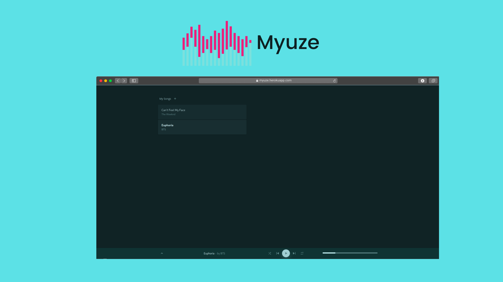

<strong>Myuze</strong> is an In-Browser Music Player with a simple UI. 

Try the App: <a href="https://myuze.herokuapp.com/" target="_blank">Myuze

## 🚀 Features
+ Load music from local disk
+ Store the music In-browser
+ On Repeat and Shuffle modes
+ Custom palette based on the album cover

## ✨ Upcoming Features
+ Share Music across browsers
+ Broadcast your music

## 🛡 License
This project is licensed under the MIT License.

